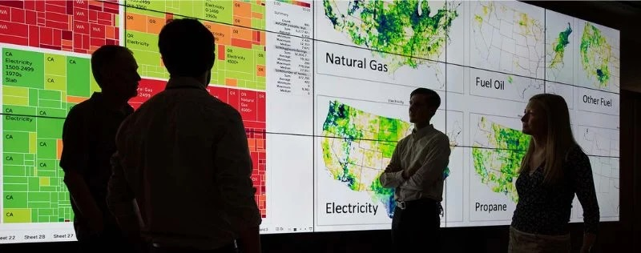

[Linkedin](https://www.linkedin.com/in/lisapwin/) |
[Contact](Lisanguyen217@gmail.com)

#### Technical Skills: SQL, Excel, Tableau, Python, R

## Education
BS, Applied Data Analytics | Syracuse University (May 2025)

## Projects
**SafeZone: Offender Geospatial Analysis Tool**

[Project Findings](https://github.com/lisapng/SafeZone)

Programmed a database using **Python** and FamilyWatchdog's repository of sex offenders nationwide to create a comprehensive demographical analysis & geospatial mapping visualization. It enables users to explore offender demographics & their spatial distribution using geolocation data.

**Behavioral Impact of Pandemic Crisis on Clients**

[Project Findings](https://drive.google.com/file/d/1RsHd1cuqi8ihXnFZczCB0r9l2JOOwzlS/view)

Analyze the impact of a public health crisis on client behavior and needs across mental health facilities to develop targeted support strategies and improve service delivery. Using **Tableau** and the Department of Mental Health (DMH)'s Data Warehouse, I segmented clients based on factors to identify and categorize vulnerable groups.   

**Market Advisory for Adobe Generative AI Integration**

[Project Findings and Presentation](https://new.express.adobe.com/webpage/HEoYNRcmdJPiK)

Collaborated with a student team to form Innowave Consulting, delivering a curated proposal to Adobe representatives on behalf of a fictitious university. Positioned the university as an adopter of Adobe Express and Firefly's generative AI tools, highlighting the competitive advantages for student engagement and market reach. Advised our clients through the strategic, legal, and ethical considerations of AI adoption while aligning the product to their institutional goals. 

**eSC Forecasting Projected Energy Usage**

[Project Findings](https://github.com/lisapng/Predicting-Energy-Usage/tree/main)
[Data Report](https://docs.google.com/document/d/1gqavBMPEfDqi6rcDye6i8c0N_mkKfbSsmDi6QFpltwI/edit?usp=sharing)

Forecasted projected HVAC energy usage in the summer months and visualized patterns, further diving into ​​the impact of global warming on increasing the electricity demand. Explored resident HVAC usage in July alongside variables such as building metrics, weather, and electricity sources to forecast the next 10 years.

**Bitcoin Trend Analysis and Forecasting**

[Project Findings](https://colab.research.google.com/drive/1AafsoCgaT1dngGj_Tv5M99mDrebFaVmI?usp=sharing#scrollTo=OKwmJm75gTyF)

Analyzed Bitcoin within 40 day time period, and probed into the reasons for spikes and dips by exploring the factors contributing to the observed upward trend. It aims to provide insights into Bitcoin in the digital era & its rapid responsiveness to the economic market dynamics

